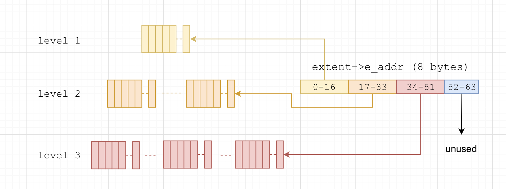
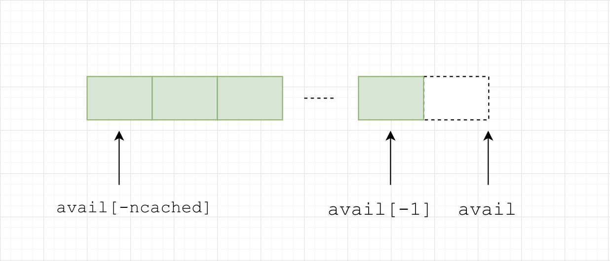
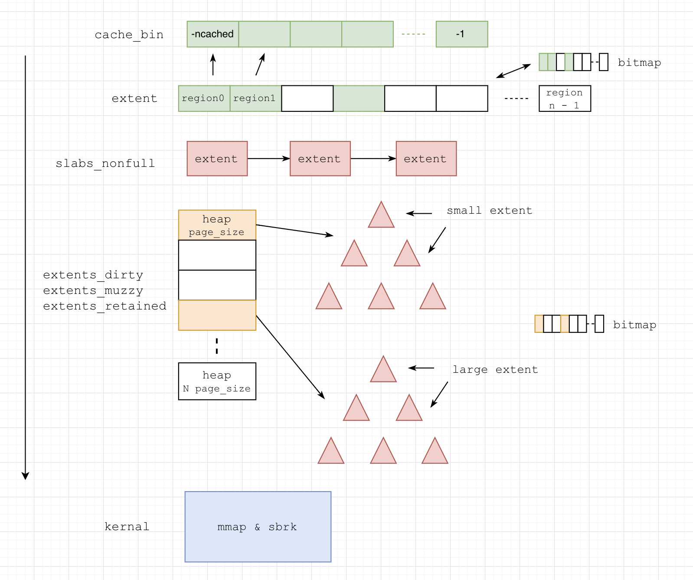

## JeMalloc
 JeMalloc 是一款内存分配器，与其它内存分配器相比，它最大的优势在于多线程情况下的高性能以及内存碎片的减少。

这篇文章介绍 **JeMalloc-5.1.0** 版本（release 日期：2018年5月9日）的实现细节。

---

对于对老版本比较熟悉的人来说，有几点需要说明：

1. chunk 这一概念被替换成了 extent
2. dirty page 的 decay（或者说 gc） 变成了两阶段，dirty -> muzzy -> retained
3. huge class 这一概念不再存在
4. 红黑树不再使用，取而代之的是 pairing heap

## 基础知识

以下内容介绍 JeMalloc 中比较重要的概念以及数据结构。

#### size_class

每个 `size_class` 代表 jemalloc 分配的内存大小，共有 NSIZES（232）个小类（如果用户申请的大小位于两个小类之间，会取较大的，比如申请14字节，位于8和16字节之间，按16字节分配），分为2大类：

* `small_class`（*小内存*） : 对于64位机器来说，通常区间是 [8, 14kb]，常见的有 8, 16, 32, 48, 64, ..., 2kb, 4kb, 8kb，注意为了减少内存碎片并不都是2的次幂，比如如果没有48字节，那当申请33字节时，分配64字节显然会造成约50%的内存碎片
* `large_class`（*大内存*）: 对于64位机器来说，通常区间是 [16kb, 7EiB]，从 4 * page_size 开始，常见的比如 16kb, 32kb, ..., 1mb, 2mb, 4mb，最大是 $2^{62}+3^{60}$
* `size_index` :  size 位于 `size_class` 中的索引号，区间为 [0，231]，比如8字节则为0，14字节（按16计算）为1，4kb字节为28，当 size 是 `small_class` 时，`size_index` 也称作 `binind`

#### base

用于分配 jemalloc 元数据内存的结构，通常一个 `base` 大小为 2mb， 所有 `base` 组成一个链表。

* `base.extents[NSIZES]` : 存放每个 `size_class` 的 `extent` 元数据

#### bin

管理正在使用中的 `slab`（即用于小内存分配的 `extent`） 的集合，每个 `bin` 对应一个 `size_class`

- `bin.slabcur` : 当前使用中的 `slab`

- `bin.slabs_nonfull` : 有空闲内存块的 `slab`

#### extent

管理 jemalloc 内存块（即用于用户分配的内存）的结构，每一个内存块大小可以是 `N * page_size(4kb)`（N >= 1）。每个 extent 有一个序列号（serial number）。

一个 `extent` 可以用来分配一次 `large_class` 的内存申请，但可以用来分配多次 `small_class` 的内存申请。

* `extent.e_bits` : 8字节长，记录多种信息
* `extent.e_addr` : 管理的内存块的起始地址
* `extent.e_slab_data` : 位图，当此 `extent` 用于分配 `small_class` 内存时，用来记录这个 `extent` 的分配情况，此时每个 `extent` 的内的小内存称为 `region`

#### slab

当 extent 用于分配 `small_class` 内存时，称其为 `slab`。一个 `extent` 可以被用来处理多个同一 `size_class` 的内存申请。

#### extents

管理 `extent` 的集合。

* `extents.heaps[NPSIZES+1]` : 各种 `page(4kb)` 倍数大小的 `extent`
* `extents.lru` : 存放所有 `extent` 的双向链表
* `extents.delay_coalesce` : 是否延迟 `extent` 的合并

#### arena

用于分配&回收 `extent` 的结构，每个用户线程会被绑定到一个 `arena` 上，默认每个逻辑 CPU 会有 4 个 `arena` 来减少锁的竞争，各个 arena 所管理的内存相互独立。

* `arena.extents_dirty` : 刚被释放后空闲 `extent` 位于的地方
* `arena.extents_muzzy` : `extents_dirty` 进行 lazy purge 后位于的地方，`dirty -> muzzy`
* `arena.extents_retained` : `extents_muzzy` 进行 decommit 或 force purge 后 `extent` 位于的地方，`muzzy -> retained`
* `arena.large` : 存放 `large extent` 的 `extents`
* `arena.extent_avail` : heap，存放可用的 `extent` 元数据
* `arena.bins[NBINS]` : 所以用于分配小内存的 `bin`
* `arena.base` : 用于分配元数据的 `base`

| 内存状态 |                            备注                            |
| :------: | :--------------------------------------------------------: |
|  clean   |                   分配给用户或 `tcache`                    |
|  dirty   |            用户调用 free 或 `tcache` 进行了 gc             |
|  muzzy   |        `extents_dirty` 对 `extent` 进行 lazy purge         |
| retained | `extents_muzzy` 对 `extent` 进行了 decommit 或 force purge |

> purge 及 decommit 在内存 gc 模块介绍

#### rtree

全局唯一的存放每个 `extent` 信息的 Radix Tree，以 `extent->e_addr` 即 `uintptr_t` 为 key，以我的机器为例，`uintptr_t`  为64位（8字节）， `rtree` 的高度为3，由于 `extent->e_addr` 是 `page(1 << 12)` 对齐的，也就是说需要 64 - 12 = 52 位即可确定在树中的位置，每一层分别通过第0-16位，17-33位，34-51位来进行访问。

#### cache_bin

每个线程独有的用于分配小内存的缓存

* `low_water` : 上一次 gc 后剩余的缓存数量
* `cache_bin.ncached` : 当前 `cache_bin` 存放的缓存数量
* `cache_bin.avail` : 可直接用于分配的内存，从左往右依次分配（注意这里的寻址方式）

#### tcache

每个线程独有的缓存（Thread Cache），大多数内存申请都可以在 `tcache` 中直接得到，从而避免加锁

* `tcache.bins_small[NBINS]` : 小内存的 `cache_bin`

#### tsd

Thread Specific Data，每个线程独有，用于存放与这个线程相关的结构

* `tsd.rtree_ctx` : 当前线程的 rtree context，用于快速访问 `extent` 信息
* `tsd.arena` : 当前线程绑定的 `arena`
* `tsd.tcache` : 当前线程的 `tcache`

## 内存分配（malloc）

#### 小内存(small_class)分配

首先从 `tsd->tcache->bins_small[binind]` 中获取对应 `size_class` 的内存，有的话将内存直接返回给用户，如果 `bins_small[binind]` 中没有的话，需要通过 `slab(extent)` 对 `tsd->tcache->bins_small[binind]` 进行填充，一次填充多个以备后续分配，填充方式如下（当前步骤无法成功则进行下一步）：

1. 通过 `bin->slabcur` 分配
2. 从 `bin->slabs_nonfull` 中获取可使用的 `extent`
3. 从 `arena->extents_dirty` 中回收 `extent`，回收方式为 ***best-fit***，即满足大小要求的**最小** `extent`，在 `arena->extents_dirty->bitmap` 中找到满足大小要求并且第一个非空 heap 的索引 `i`，然后从 `extents->heaps[i]` 中获取第一个 `extent`。由于 `extent` 可能较大，为了防止产生内存碎片，需要对 `extent` 进行分裂（伙伴算法）
4. 从 `arena->extents_muzzy` 中回收 `extent`，回收方式为 ***first-fit***，即满足大小要求且**序列号最小地址最低（最旧）**的 `extent`，遍历每个满足大小要求并且非空的 `arena->extents_dirty->bitmap`，获取其对应 `extents->heaps` 中第一个 `extent`，然后进行比较，找到最旧的 `extent`，之后仍然需要分裂
5. 从 `arena->extents_retained` 中回收 `extent`，回收方式与 `extents_muzzy` 相同
6. 尝试通过 `mmap` 向内核获取所需的 `extent` 内存，并且在 `rtree` 中注册新 `extent` 的信息
7. 再次尝试从 `bin->slabs_nonfull` 中获取可使用的 `extent`

简单来说，这个流程是这样的，`cache_bin -> slab -> slabs_nonfull -> extents_dirty -> extents_muzzy -> extents_retained -> kernal`。

#### 大内存(large_class)分配

大内存不存放在 `tsd->tcache` 中，因为这样可能会浪费内存，所以每次申请都需要重新分配一个 `extent`，申请的流程和小内存申请 `extent` 流程中的3, 4, 5, 6是一样的。

## 内存释放（free）

#### 小内存释放

在 `rtree` 中找到需要被释放内存所属的 `extent` 信息，将要被释放的内存还给 `tsd->tcache->bins_small[binind]`，如果 `tsd->tcache->bins_small[binind]` 已满，需要对其进行 flush，流程如下：

1. 将这块内存返还给所属 `extent`，如果这个 `extent` 中空闲的内存块变成了最大（即没有一份内存被分配），跳到2；如果这个 `extent` 中的空闲块变成了1并且这个 `extent` 不是 `arena->bins[binind]->slabcur`，跳到3
2. 将这个 `extent` 释放，即插入 `arena->extents_dirty` 中
3. 将  `arena->bins[binind]->slabcur` 切换为这个 `extent`，前提是这个 `extent` “更旧”（序列号更小地址更低），并且将替换后的 `extent` 移入 `arena->bins[binind]->slabs_nonfull`

#### 大内存释放

因为大内存不存放在 `tsd->tcache` 中，所以大内存释放只进行小内存释放的步骤2，即将 `extent` 插入 `arena->extents_dirty` 中。

## 内存再分配（realloc）

#### 小内存再分配

1. 尝试进行 `no move` 分配，如果两次申请位于同一 `size class` 的话就可以不做任何事情，直接返回。比如第一次申请了12字节，但实际上 jemalloc 会实际分配16字节，然后第二次申请将12扩大到15字节或者缩小到9字节，那这时候16字节就已经满足需求了，所以不做任何事情，如果无法满足，跳到2
2. 重新分配，申请新内存大小（参考**内存分配**），然后将旧内存内容拷贝到新地址，之后释放旧内存（参考**内存释放**），最后返回新内存

#### 大内存再分配

1. 尝试进行 `no move` 分配，如果两次申请位于同一 `size class` 的话就可以不做任何事情，直接返回。
2. 尝试进行 `no move resize` 分配，如果第二次申请的大小大于第一次，则尝试对当前地址所属 `extent` 的下一地址查看是否可以分配，比如当前 `extent` 地址是 0x1000，大小是 0x1000，那么我们查看地址 0x2000 开始的 `extent` 是否存在（通过 `rtree`）并且是否满足要求，如果满足要求那两个 `extent` 可以进行合并，成为一个新的 `extent` 而不需要重新分配；如果第二次申请的大小小于第一次，那么尝试对当前 `extent` 进行 split，移除不需要的后半部分，以减少内存碎片；如果无法进行 `no move resize` 分配，跳到2
3. 重新分配，申请新内存大小（参考**内存分配**），然后将旧内存内容拷贝到新地址，之后释放旧内存（参考**内存释放**），最后返回新内存

## 内存 GC

分为2种， `tcache` 和 `extent`  GC。其实更准确来说是 decay，为了方便还是用 gc 吧。

### tcache GC

针对 `small_class`，防止某个线程预先分配了内存但是却没有实际分配给用户，会定期将缓存 flush 到 `extent`。

##### GC 策略

每次对于 `tcache` 进行 malloc 或者 free 操作都会执行一次计数，默认情况下达到228次就会触发 gc，每次 gc 一个 `cache_bin`。

##### 如何 GC

1. `cache_bin.low_water > 0` : gc 掉 `low_water` 的 3/4，同时，将 `cache_bin` 能缓存的最大数量缩小一倍
2. `cache_bin.low_water < 0` : 将 `cache_bin` 能缓存的最大数量增大一倍

总的来说保证当前 `cache_bin` 分配越频繁，则会缓存更多的内存，否则则会减少。

### extent GC

**调用 free 时，内存并没有归还给内核**。 jemalloc 内部会不定期地将没有用于分配的 `extent` 逐步 GC，流程和内存申请是反向的， `free -> extents_dirty -> extents_muzzy -> extents_retained -> kernal`。

##### GC 策略

默认10s为 `extents_dirty` 和 `extents_muzzy` 的一个 gc 周期，每次对于 `arena` 进行 malloc 或者 free 操作都会执行一次计数，达到1000次会检测有没有达到 gc 的 deadline，如果是的话进行 gc。

注意并不是每隔10s一次性 gc，实际上 jemalloc 会将10s划分成200份，即每隔0.05s进行一次 gc，这样一来如果 t 时刻有 N 个 `page` 需要 gc，那么 jemalloc 尽力保证在 t+10 时刻这 N 个 `page` 会被 gc 完成。

严格来说，对于两次 gc 时刻 $t_{1}$ 和 $t_{2}$，在 $t_{2}-t_{1}$ 时间段内产生的所有 `page`（dirty page 或 muzzy page） 会在 ($t_{2}$, $ t_{2}+10$] 被 gc 完成。

对于 N 个需要 gc 的 `page` 来说，并不是简单地每0.05s处理 N/200 个 `page`，jemalloc 引入了 **`Smoothstep`**（主要用于计算机图形学）来获得更加平滑的 gc 机制，这是 jemalloc 非常有意思的一个点。

jemalloc 内部维护了一个长度为200的数组，用来计算在10s的 gc 周期内每个时间点应该对多少 `page` 进行 gc。这样保证两次 gc 的时间段内产生的需要 gc 的 `page` 都会以图中绿色线条（默认使用 smootherstep）的变化曲线在10s的周期内从 N 减为 0（从右往左）。

##### 如何 GC

先进行 `extents_dirty` 的 gc，后进行 `extents_muzzy` 。

* 将 `extents_dirty` 中的 `extent` 移入 `extents_muzzy`：
  1. 在 `extents_dirty` 中的 LRU 链表中，获得要进行 gc 的 `extent`，尝试对 `extent` 进行前后合并（前提是两个 `extent` 位于同一 `arena` 并且位于同一 `extents` 中），获得新的 `extent`，然后将其移除

  2. 对当前 `extent` 管理的地址进行 lazy purge，即通过 `madvise` 使用 `MADV_FREE` 参数告诉内核当前 `extent` 管理的内存可能不会再被访问

  3. 在 `extents_muzzy` 中尝试对当前 `extent` 进行前后合并，获得新的 `extent`，最后将其插入 `extents_muzzy`

* 将 `extents_muzzy` 中的 `extent` 移入 `extents_retained` :
  1. 在 `extents_muzzy` 中的 LRU 链表中，获得要进行 gc 的 `extent`，尝试对 `extent` 进行前后合并，获得新的 `extent`，然后将其移除

  2. 对当前 `extent` 管理的地址进行 decommit，即调用 `mmap` 带上 `PROT_NONE` 告诉内核当前 `extent` 管理的地址可能不会再被访问，如果 decommit 失败，会进行 force purge，即通过 `madvise` 使用 `MADV_DONTNEED` 参数告诉内核当前 `extent` 管理的内存可能不会再被访问

  3. 在 `extents_retained` 中尝试对当前 `extent` 进行前后合并，获得新的 `extent`，最后将其插入 `extents_retained`

* jemalloc 默认不会将内存归还给内核，只有进程结束时，所有内存才会 `munmap`，从而归还给内核。不过可以手动进行 `arena` 的销毁，从而将 `extents_retained` 中的内存进行 `munmap`

## 内存碎片

JeMalloc 保证内部碎片在20%左右。对于绝大多数 `size_class` 来说，都属于 $2^{x}$ 的 group $y$，比如 160，192，224，256都属于 $2^{8-1}$ 的 group 7。对于一个 group 来说，会有4个 `size_class`，每个 size 的大小计算是这样的，$(1 << y) + (i << (y-2))$，其中 i 为在这个 group 中的索引（1，2，3，4），比如 160 为 $(1 << 7) + (1 << 5)$，即 $5 * 2^{7-2}$。

对于两组 group 来说：

| Group |                            Size                            |
| :---: | :--------------------------------------------------------: |
|   y   | $5 * 2^{y-2}$, $6 * 2^{y-2}$, $7 * 2^{y-2}$, $8 * 2^{y-2}$ |
|  y+1  | $5 * 2^{y-1}$, $6 * 2^{y-1}$, $7 * 2^{y-1}$, $8 * 2^{y-1}$ |

取相差最大的第一组的最后一个和第二组的第一个，内存碎片约为 $\frac{5 * 2^{y-1} - 8 * 2^{y-2} + 1}{5 * 2^{y-1}}$ 约等于 20%。

## JeMalloc 实现上的优缺点

#### 优点

1. 采用多个 `arena` 来避免线程同步
2. 细粒度的锁，比如每一个 `bin` 以及每一个 `extents` 都有自己的锁
3. Memory Order 的使用，比如 `rtree` 的读写访问有不同的原子语义（relaxed, acquire, release）
4. 结构体以及内存分配时保证对齐，以获得更好的 cache locality
5. `cache_bin` 分配内存时会通过栈变量来判断是否成功以避免 cache miss
6. dirty `extent` 的 delay coalesce 来获得更好的 cache locality；`extent` 的 lazy purge 来保证更平滑的 gc 机制
7. 紧凑的结构体内存布局来减少占用空间，比如 `extent.e_bits`
8.  `rtree` 引入 `rtree_ctx` 的两级 `cache` 机制，提升 `extent` 信息获取速度的同时减少 cache miss
9. `tcache` gc 时对缓存容量的动态调整

#### 缺点

1.  `arena` 之间的内存不可见
    * 某个线程在这个 `arena` 使用了很多内存，之后这个 `arena` 并没有其他线程使用，导致这个 `arena` 的内存无法被 gc，占用过多
    * 两个位于不同 `arena` 的线程频繁进行内存申请，导致两个 `arena` 的内存出现大量交叉，但是连续的内存由于在不同 `arena` 而无法进行合并
2.  目前只想到了一个

## 总结

文章开头说 JeMalloc 的优点在于多线程下的性能以及内存碎片的减少，对于保证多线程性能，有不同 `arena`、降低锁的粒度、使用原子语义等等；对于内存碎片的减少，有经过设计的多种 `size_class`、伙伴算法、gc 等等。

阅读 JeMalloc 源码的意义不光在于能够精确描述每次 malloc 和 free 会发生什么，还在于学习内存分配器如何管理内存。malloc 和 free 是静态的释放和分配，而 `tcache` 和 `extent` 的 gc 则是动态的管理，熟悉后者同样非常重要。

除此以外还能够帮助自己在编程时根据相应的内存使用特征去选择合适的内存分配方法，甚至是自己实现的内存分配器。

最后个人觉得 jemalloc 最有意思的地方就在于 `extent` 的曲线 gc 了。

## 参考

[JeMalloc](http://jemalloc.net/jemalloc.3.html)

[JeMalloc-4.0.3](https://youjiali1995.github.io/allocator/jemalloc/)

[JeMalloc-Purge](https://youjiali1995.github.io/allocator/jemalloc-purge/)

[图解 TCMalloc](https://zhuanlan.zhihu.com/p/29216091)

[TCMalloc分析 - 如何减少内存碎片](https://zhuanlan.zhihu.com/p/29415507)

[TCMalloc](http://goog-perftools.sourceforge.net/doc/tcmalloc.html)

