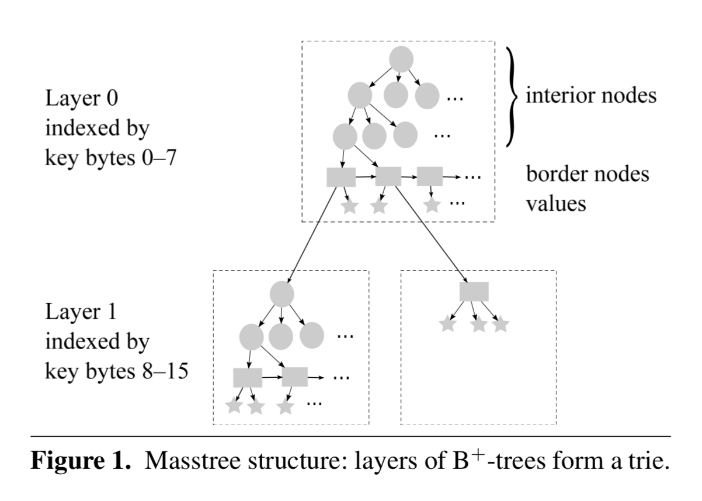
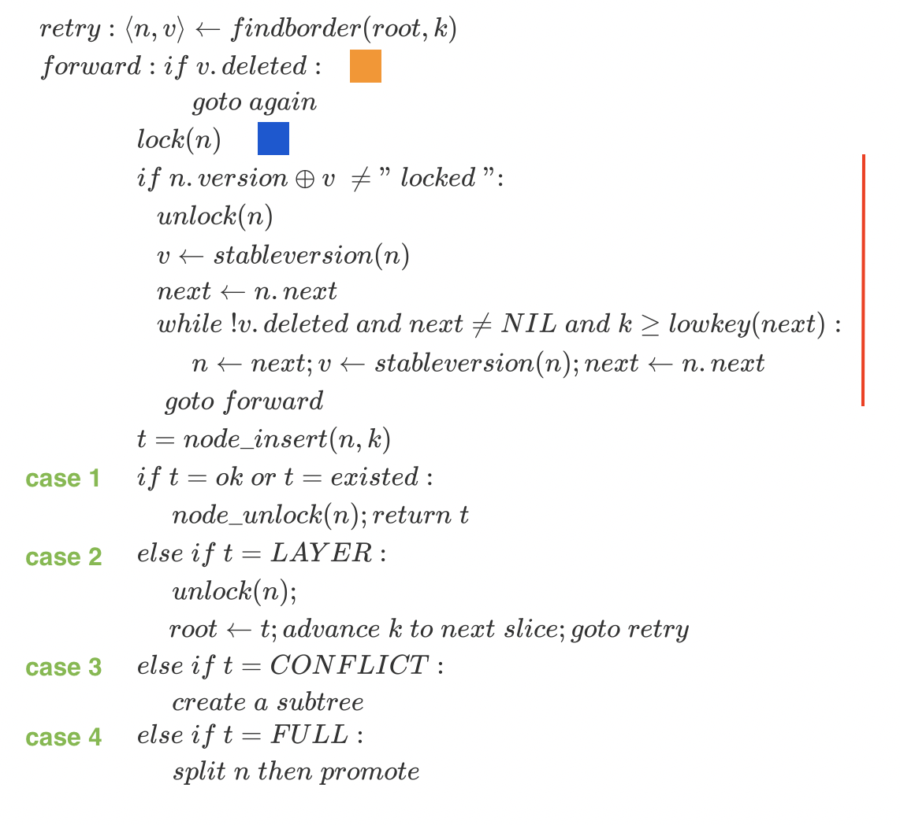
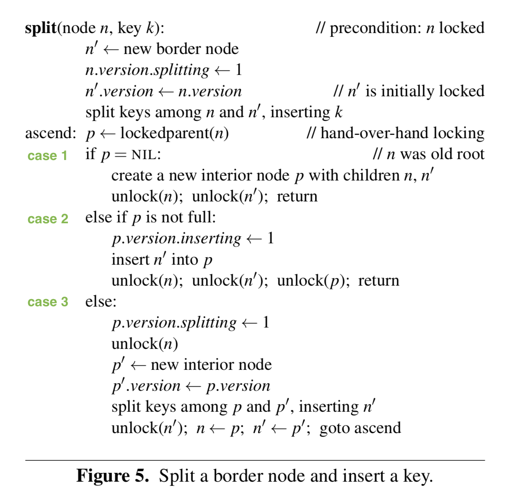
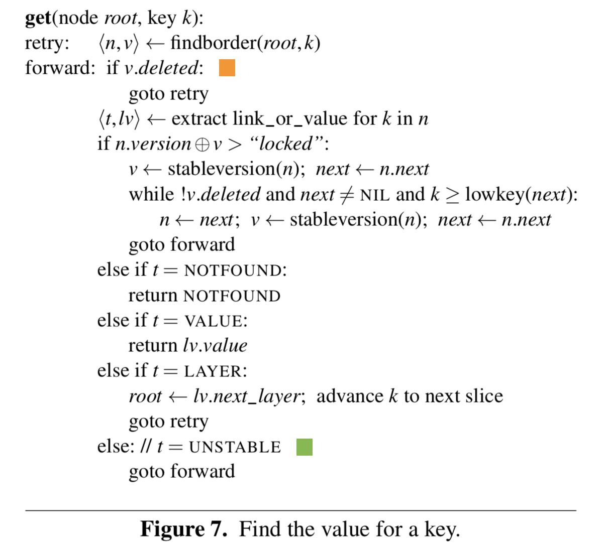
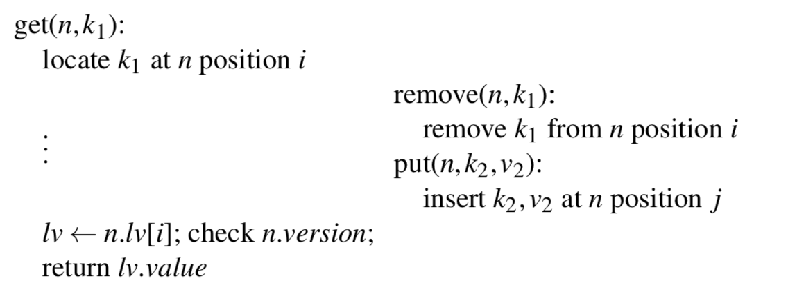

## Mass Tree

这篇文章介绍 Trie 树和 B+ 树结合而成的并发算法——**Mass Tree**。

&nbsp;Mass Tree 是 2012 年提出的，引用了很多 OLFIT Tree 以及 B<sup>link</sup> Tree 的概念。（这个专栏的第一篇文章介绍了 B<sup>link</sup> Tree。）

&nbsp;

论文链接：[Cache Craftiness for Fast Multicore Key-Value Storage](https://pdos.csail.mit.edu/papers/masstree:eurosys12.pdf)

&nbsp;

### Mass Tree 结构

从结构上来说，Mass Tree 是由一层或多层 B+ 树组成的 Trie 树。



上图中，*圆形*代表内部节点（interior node，也就是 B+ 树的 branch node），*矩形*代表边缘节点（border node，也就是 B+ 树的 leaf node），*五角星*代表 value。border node 的 value 域可能存放的是数据，也可能存放的是下一层子树的根节点。

每个虚线框代表一棵 B+ 树，对于每一层（Layer）的 B+ 树，采用8字节进行索引。长度小于 (8h + 8) 字节的 key 会被存放在 layer <=h。比如，两个 key 存放在 layer 1，那么它们的前8字节是相同的。

> 注意上面 <= h，极端情况下才会放在 h 层，否则会尽可能地把 key 放在较低的层，比如 Mass Tree 中所有 key 都是8字节，那么它们都位于 layer 0，突然来了一个1k字节长度的 key，显然没有必要把这个 key 放在第一百多层，如果这个 key 的前8字节没有和其他 key 冲突的话，那么它也会被放在 layer 0，如果发生了冲突，那么我们只需要生成新的子树（subtree），把这个 key 放在 layer 1 就可以，即层数是懒惰生成的，只有当出现节点8字节索引相同时才会生成新的 layer。

&nbsp;

同一层的所有叶节点会被双向连接（`next` 和 `prev`）在一起，但是内部结点是不连接的，这和 B<sup>link</sup> Tree 不一样，后者对所有节点维护单向连接（`next`），所以 Mass Tree 在进行根节点到叶子节点的下降过程时，逻辑和  B<sup>link</sup> Tree 是不一样的。

B<sup>link</sup> Tree 的每一个 border node 都带有一个 higher key，用于判断是否需要进行节点右移，但是 Mass Tree 没有 higher key，所以判断是否右移需要获取下一个节点。

> 对于叶节点来说，higher key 并不是必须的。请问这是为什么？

Mass Tree 给出了完整的内部节点和叶节点结构，这里只介绍叶节点的原子状态跃迁，为了防止读线程读到中间状态，叶节点被设计成最多存放 15 个 key，引入了一个8字节64位的 `permutation`(uint64_t)，这个 `permutation` 被划分成16份，每份4位，其中1份代表当前节点的 key 数量，另外15份用于存放每个 key 在节点中实际位置的索引，key 的插入是顺序插入，之后只需要修改 `permutation` 来更新节点内 key 的索引信息，然后施加一个 `release` 语义，当读线程对这个节点的 `permutation` 施加 `acquire` 语义时，可以获取到完整的节点信息。

&nbsp;&nbsp;

### Mass Tree 算法

#### 并发策略

Mass Tree 的并发策略和 OLFIT Tree 是相似的：

1. fine-grained locking，即节点锁，解决 write-write 竞争，同一时刻只有一个线程可以对当前节点进行写操作
2. optimistic concurrency control，即节点 `version` (uint32_t)，解决 read-write 竞争，读开始前和读结束后都需要获取当前节点的最新 version，来判断在读过程中当前节点是否发生了写操作（插入或分裂），同时对节点的写操作都需要先修改 version，在插入 key 之前需要设置 `inserting` 标记，插入完成之后将 insert 的 vinsert + 1；在分裂之前需要设置 `spliting` 标记，分裂完成之后将 split 的 vsplit + 1。


和 `permutation` 一样，`version` 也被划分成了多个域，除了带有 insert 和 split 信息之外，还包含一个 lock bit，用于加锁；一个 root bit，用于指示否是根节点；一个 border bit，用于指示是否是 border node；一位 deleted 位，用于指示这个节点是否被标记为删除。

&nbsp;

#### 下降流程

对于每次插入，获取，删除操作，都需要从 root（可能是整棵树的根节点，也可能是某棵子树的根节点） 下降到对应的叶节点（border node）。


首先，在开始读取节点之前，必须获得节点的 stable version（图中橙色方块），即 `version` 中的 `inserting` 和 `spliting` 位都为0。

其次，在下降之前，需要获取最新的 root，因为在开始下降前，根节点可能分裂了，导致其发生了改变（图中蓝色方块）。

最后，如果当前节点已经是叶节点，那么可以返回，否则需要进行下降，读取内部结点根据 `key[x, x+8)`(8字节) 获得下降节点之后，分为3种情况处理：

1. case 1 那行伪代码可以这样用 C 语言表示：

   ```C
   uint32_t before = node_get_stable_version(n);
   // read node here
   uint32_t after = node_get_version(n); // no need to be stable, just latest version
   if ((before ^ after == LOCK_BIT) || (before ^ after == 0))
       // neither insert nor split happened
   ```

   节点在我们读取期间没有发生任何变化，我们可以安全地进行下降；

2. 节点发生了变化，而且是分裂，那么我们需要从根节点重新进行下降（内部节点没有相互连接起来，所以不能像 B<sup>link</sup> Tree 那样获取右节点）；

3. 节点发生了变化，但只是插入，只需要重新对当前节点进行下降

> 注意第二个黄色方块，这一行非常关键，如果你细看下的话，它似乎可以挪到 case 1 的 if 语句里面，但实际上不能这样做。因为如果当前节点的孩子节点发生了分裂，但是还没来得及将新节点插入到当前节点，对调这两行代码，可能会导致下降到错误的节点。

&nbsp;

#### 插入流程

作者只给出了读取伪代码，这里给出插入伪代码。



当我们通过 `findborder` 下降到叶节点后，需要对其加锁（图中蓝色方块），但是此时并不能直接将 key 进行插入，当两个写线程同时下降到同一个叶节点时，只有一个线程可以进行写入，所以加锁后需要查看在加锁前是否有其他线程对这个节点进行了写入，如果有的话需要查看是否需要右移，这里的逻辑和 B<sup>link</sup> Tree 是一样的。

当我们成功加锁并且定位到正确的叶节点之后，可以进行写入，结果有4种：

1. 插入 key 成功或 key 已经存在；
2. 需要下降到下一层，同时需要增加索引的偏移；
3. 存在索引冲突，比如 "12345678AA" 和 "12345678BB"，此时需要创建一棵子树，存放 "AA" 和 "BB"，同时需要把原来存放 "AA" 的地方替换成这棵子树的根节点
4. 节点已满，需要分裂之后再次插入（见下一小节）

> 橙色方块在下面删除流程中介绍

&nbsp;

#### 分裂流程



分裂流程和 B<sup>link</sup> Tree 是一样的逻辑，需要同时锁住当前节点以及父节点，分为三种情况：

1. 当前节点没有父节点，即当前节点是某个子树的根节点或者整棵树的根节点，在这种情况下我们需要生成新节点作为根节点。有个特殊的地方需要处理，对于子树来说，它的节点存放在上层的叶节点中，但是上图中并没有提到当子树分裂时，如何将上层叶节点中旧的根节点替换掉，这里有两种处理方法：
   + 懒惰处理，不设置根节点的父节点，但是会在写路径中添加判断，当从叶节点下降到某个子树的根节点时，会判断其是否是真正的根节点，如果不是的话，会追溯到新的父节点，然后在叶节点替换掉旧根节点（这种懒惰处理的思想很巧妙）；
   + 设置子树的根节点的父节点为上一层的叶节点，只需要在 case1 和 case2 中添加一种 case，处理子树根节点的替换（这两种方法没有优劣之分）
2. 父节点没有满，则只需要将 fence key 和新节点插入到父节点
3. 父节点已满，需要分裂父节点然后进行插入，之后需要将分裂的新节点提升到更上层

> Mass Tree 每个节点都有一个指向父节点的指针，B<sup>link</sup> Tree 的节点可以不需要父节点，请问这是为什么？ 

&nbsp;

#### 读取流程



整体而言和插入流程是一样的，这里不再展开，有个点需要注意：

unstable 状态（图中绿色方块），插入流程的 case 3，当出现8字节索引相同时，需要生成子树来替换掉这个 value，但是这个操作不会修改 `inserting` 或者 `spliting` 标记，所以需要先标记这个 slot 为 unstable，然后把 value 替换为子树根节点的指针（以及一些其他操作），来防止读到不稳定状态（说实话，这个状态的引入似乎增加了复杂性，其实可以在替换之前标记 `inserting`，这样也会触发重试）；

> 橙色方块，在下面删除流程中介绍

&nbsp;

#### 删除流程

这里只讨论**逻辑删除**，**物理删除**需要额外的技术，比如 hazard pointer，epoch-based reclamation 等等。

逻辑删除和B+树的类似，但是我们并不对 key 少的节点进行合并，当节点 key 减少到0时，需要标记这个节点为 `deleted`，然后将其从父节点删除，同时如果是叶节点的话，还需要维护叶节点的双向连接（这是为什么叶节点需要双向连接的一大原因，维护起来简单）。如果某棵子树为空的话也可以删除整棵子树。当其他线程发现节点处于 `deleted` 状态时，需要进行重试，因为这个节点逻辑上是不存在的。

除此以外还有一种特殊情况需要考虑：



左边的线程根据 k1 定位到了位置 i，在读取 v1 之前这个节点发生了删除位于位置 i 的 k1，同时在位置 j 处插入 k2，如果 i 等于 j，可能导致左边的线程读取到 v2，为了解决这个问题，需要在索引 i 被删除后重新利用时增加节点的 `vinsert` 域。

&nbsp;

以上就是 Mass Tree 算法的整体介绍。

&nbsp;

### Mass Tree 优化

其实节点的结构，比如每个节点存放15个 key 本身就是作者测试过后的最优解。作者还在论文里也提到了不少优化，比如节点预取，索引（`uint64_t`）用整形数比较，定制的节点内存分配器，以及 key 的后缀的管理，等等。这里不做展开。

&nbsp;

### Mass Tree 总结

1. Trie 和 B+ 两种索引树的结合，使得在下降过程中的重试不需要从整棵树的根节点开始，同时加快拥有相同前缀的 key 的处理速度
2. 具体的内部结点与外部节点的结构
3. fine-grained locking 写以及 lock-free 读
4. 比较具体的节点删除机制
5. 较小的节点减少了线程的竞争

> 需要指出的是这个算法不支持性能线性扩展，不过这并不是问题。

这个算法实现起来很有**挑战性**，个人认为主要有两个方面，第一个是对于**树结构的把握**，Mass Tree 是 Trie 和 B+ 树的结合。第二个是对于**并发下可见性的理解**，”先改哪个域后改哪个域“，”谁先可见谁后可见“，”谁何时可见“，“在哪加以及加不加 memory barrier”等等这样的问题需要花很多时间考虑，而且出现 bug 非常难调试。

Mass Tree 性能比我预想中要好很多，对于均匀分布的10字节 key 随机插入，数据量1000万，在我的机器上4个线程可以到500万以上的 tps；对于分布集中的测试数据，可以到1000万以上。其实**对于内存索引来说，cache miss 对性能造成的影响有时候是远远大于线程竞争的**，所以尽管数据分布非常集中（线程竞争更多），仍然可以获得更高的性能。

&nbsp;

这是我的 Mass Tree 实现：[UncP/aili](https://github.com/UncP/aili)，没有实现删除操作。

这是另一个实现：[https://github.com/rmind/masstree](https://github.com/rmind/masstree)，代码确实漂亮。他采用了激进生成子树的策略，缺点就是 cache locality 在有些情况下不好。

这是论文作者的实现：[https://github.com/kohler/masstree-beta](https://github.com/kohler/masstree-beta)。

&nbsp;

#### PS:

最后推荐一个算法，Palm Tree，这个算法很好地诠释了什么是大道至简。你可以在这个专栏之前的文章中找到其介绍。