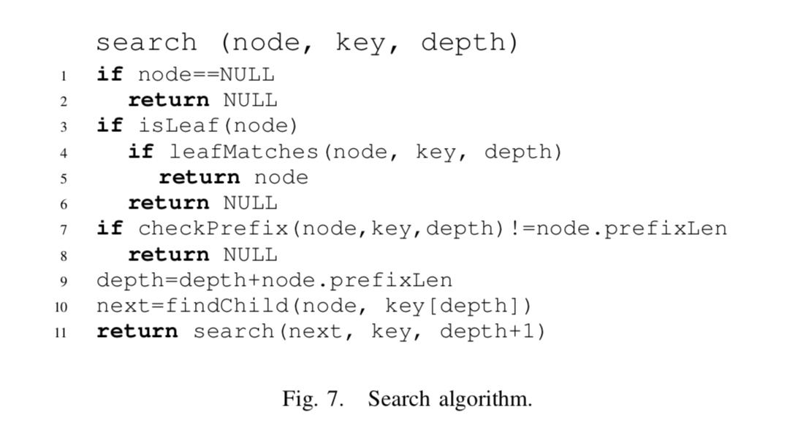
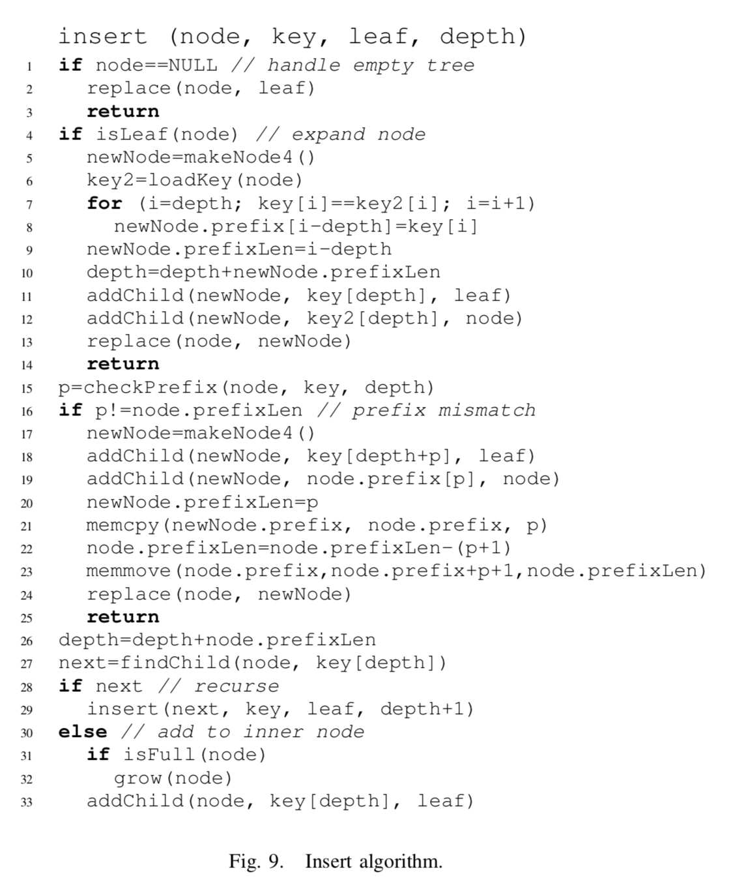
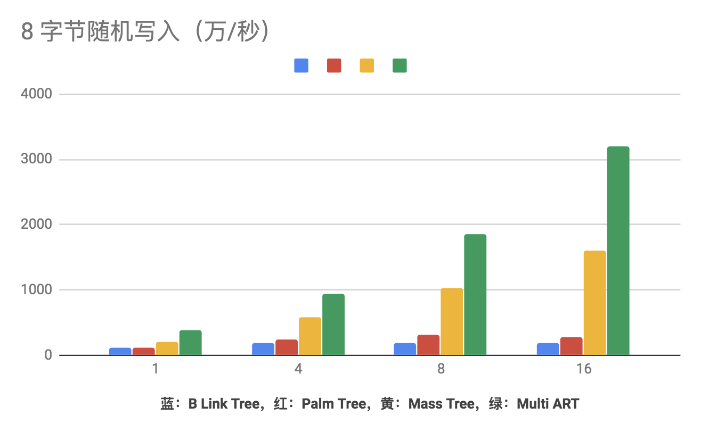

这篇文章介绍 **Adaptive Radix Tree** 并且提供其并发算法 **Multi-ART**。

&nbsp;

论文链接：[The Adaptive Radix Tree: ARTful Indexing for Main-Memory Databases](https://db.in.tum.de/~leis/papers/ART.pdf)

&nbsp;

### Adaptive Radix Tree

Adaptive Radix Tree(ART) 中文名字是可变基数树，相较于传统的 radix tree，其最大的区别在于每个节点可以容纳的 key 是动态变化的，这样既可以节省空间，又可以提高缓存局部性。

art 内部节点分为4种类型，分别是 `node4`, `node16`, `node48`, `node256`。

&nbsp;

#### Node4


`Node4` 有4个槽，存储4个 `unsigned char` 和4个指针，这些指针可以指向叶子节点(即 key 指针)，也可以指向下一层内部节点。当 `Node4` 存放第5个 key byte 时需要将其扩大为 `Node16`。 

&nbsp;

#### Node16


`Node16` 和 `Node4` 在结构上是一致的，但是 `Node16` 可以存放16个 `unsigned char` 和16个指针。当存放第17个 key byte 时需要将其扩大为 `Node48`。

&nbsp;

#### Node48


`Node48` 结构上和 `Node4`, `Node16` 有所不同，它有256个索引槽和48个指针，这256个索引槽对应 `unsigned char` 的 0-255，然后每个索引槽的值对应指针的位置，分别为 1-48，如果某个字节不存在的话，那么它的索引槽的值就是0。当存放第49个 key byte 时需要将其扩大为 `Node256`。

&nbsp;

#### Node256


`Node256` 直接存放256个指针，每个指针对应 `unsigned char` 的 0-255 区间。

&nbsp;

除了以上的可变节点，ART 还引入了两种技术来进一步减少内存占用（尤其是在 long key 情况下），分别是 `Path Compression` 和 `Lazy Expansion`。

&nbsp;

#### Path Compression & Lazy Expansion


Lazy Expansion 用于区别两个叶子节点时才进行创建内部节点，比如上图中的 `FOO`，为了节省空间，两个内部节点不会被创建，只会存在一个叶子节点，当另一个 key 比如 `FPO` 被插入时，才会创建一个内部节点以区别 `O` 和 `P`。

Path Compression 用于移除只有单个子节点的节点，比如上图中带有 `A` 的节点会被合并入父节点。

节点合并带来了前缀，前缀需要在下降时进行比较，所以产生了两种方法，一种是悲观方法，即每个节点专门开辟一个变长区间存放前缀，每次下降时需要进行比较；另一种是乐观方法，只存储前缀的长度，下降时跳过这个长度，然后到达叶子节点时再回头利用叶子节点进行前缀的比较。在 ART 的实现中结合了这两种方法，每个节点存放最多8个字节的前缀，下降会根据前缀长度进行动态切换。

&nbsp;

#### 查找算法



查找流程很简单：

1. 如果当期节点为空代表不存在；
2. 如果当前节点是叶子节点并且 key 相等那么即代表找到；
3. 如果当前节点是内部节点需要首先比较前缀，前缀不同则表明 key 不存在，相同则可以继续进行下降。

&nbsp;

#### 插入算法



插入流程大致分为以下几步：

1. 如果下降到的节点是空节点，那么用叶子节点替换掉这个叶子节点；
2. 如果下降到的节点是叶子节点，那么需要进行比较，如果 key 存在退出；否则使用新的内部节点替换到当前叶子节点，同时需要根据两个 key 获取前缀
3. 如果下降到的是内部节点，需要首先比较前缀，如果前缀不符合的话，生成新节点，令公共前缀为其前缀，公共前缀后一字节作为区分两个 key 的字节，然后将叶子节点和截断公共前缀后的老节点插入到这个新节点中
4. 如果下降到的是内部结点并且前缀相等，如果存在下一层节点的话，继续进行下降；否则直接将叶子节点插入，并根据需要进行节点大小的调整

&nbsp;

#### 删除算法

参考插入算法。

&nbsp;

&nbsp;

### Multi-ART

Multi-ART 是 ART 的并发算法，是我实习时开始琢磨的，到现在断断续续地有三个月了。Multi-ART 参考了 [Mass Tree](<https://zhuanlan.zhihu.com/p/52624601>) 的并发策略即 `lock-free read` + `fine-grained-locking write`，然后根据 ART 的特点做出了调整。

&nbsp;

#### 设计

在实现完 Mass Tree 之后决定自己设计一个并发算法，于是选择了 ART。ART 是很久之前就知道的一种索引，当时将某个 C 实现的 ART 翻译成了 C++ 实现，然后非常惊讶于其性能，所以选择了 ART 来设计并发算法。

整个设计中最核心的问题就是**"如何正确下降到下一层节点”**。

在并发 B-Tree（包括 Mass Tree）中，下降最大的障碍在于分裂，下降前根据 key 判断应该下降到 A 节点，但实际上由于节点的横向分裂实际需要下降到另一个节点 B，但是在 Multi-ART 中，情况又有很大的不同，ART 节点不存在横向分裂的行为，取而代之的是：

1. 节点竖向分裂或合并，由节点前缀变更引起
2. 节点原地扩展或收缩，由插入和删除引起


对于 B Tree 或者 Mass Tree 来说，为了保证下降到正确的节点，有两种机制，第一种是每个节点自带一个 `next` 域和一个 `sentinel key`，用于进行节点之间的右移，比如 B Link Tree；第二种是重试，即从某个子树进行重新下降，比如 Mass Tree。

对于 Multi-ART 来说，我们首先考虑**节点的原地扩展或收缩**，即上图中 `ART Node Expand` 这种情况。为了保证正确地下降，对每个节点引入 `old` 这个域（只需占用某个 bit），每次节点发生扩展或收缩时需要将当前节点标记为 `old`。如果在下降到这个节点时发现这个节点已经处于 `old` 状态，即代表它已经被一个新的节点取代了，那么为了获取正确的节点，这里可以有两种辅助机制：

1. 每个节点引入 `new` 指针，如果当前节点被替换了，通过 `new` 来获取新节点
2. 根据父节点来获取新节点，因为父节点中旧的节点会被原地替换为新节点

以上两种机制都能正常工作，考虑到 ART 原有算法，我采用了 `old` 域 + 通过父节点获取新节点这种方式。

最后我们考虑**节点的竖向分裂或合并**，即上图中 `ART Node Split` 这种情况。这里需要两个机制来保证正确性。

一是对每个节点引入 `offset` 域，即如果下降到这个节点，该从哪个偏移开始比较。比如某个节点前缀是 `ABC`，节点的 `offset` 是4，如果在另一个线程下降过程中发生了竖向分裂，那么可能前缀变成了 `BC`，`offset` 变成了 5，那么另一个线程就不能用 `offset 4` 进行比较，当它发现 `offset 5` 时，即知道发生了前缀变化，需要进行重试。

二是对每个节点引入 `expand version` 域，比较节点前缀前后都需要获取这个域来保证节点的前缀在比较时没有发生改变。

三是对每个节点引入 `parent` 域，因为两个线程可能一前一后更改了前缀，所以第二个线程替换父节点中的节点时应该获取上图中的绿色节点，而不是下降时的红色节点。

&nbsp;

为了支持这个算法，对每个 ART 节点引入了 `version`(8字节) 和 `parent`(8字节) 域。


```markdown
off: 节点的 offset
count: 节点的 key 数量
prefix_len: 前缀长度
type: node4 | node16 | node48 | node256
old: 节点是否是旧的
lock: 用于写线程加锁
expand: 是否正在发生前缀变化
vexpand: 前缀的 version
insert 和 vinsert 目前没有使用
```

&nbsp;

以上就是 Multi-ART 的设计核心问题，其实花的精力远远不止以上这点篇幅，还有很多其它的设计细节和实现细节，懒得展开了，可以参考这个专栏之前的相关并发算法的文章。

&nbsp;

#### 性能



预计在55个线程左右 Multi-ART 8字节每秒随机写入可以破亿。

我的 GitHub 上有这四个算法的实现，这个知乎专栏也有这个四个算法的介绍。

&nbsp;

Multi-ART 的性能相较于 B Tree based 的并发算法，几乎是碾压。（当然这里需要指出的是为了实现的简单，并不保证 Multi-ART 的 Node4, Node16 和 Node48 中 key 是有序的）。

Multi-ART 的高性能有很多因素，比如算法时间复杂度低，cache 友好的节点设计，良好的并发策略设计等等。

&nbsp;

&nbsp;

### 总结

这篇文章介绍了 ART 以及 Multi-ART 的设计与实现。

GitHub 地址：[UncP/aili](https://github.com/UncP/aili)。